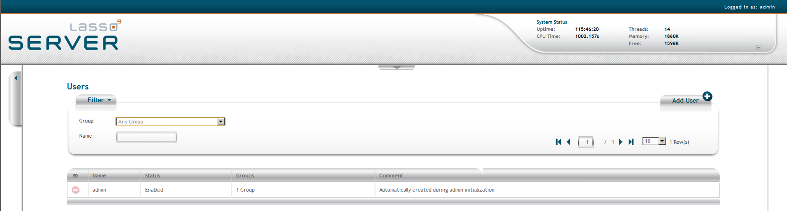
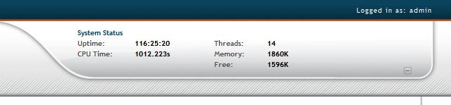
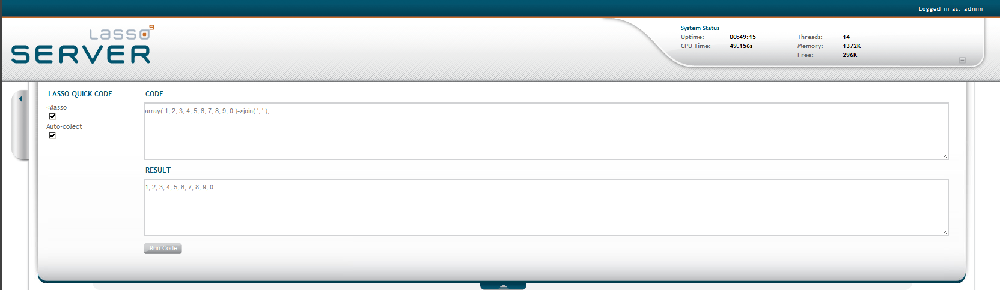
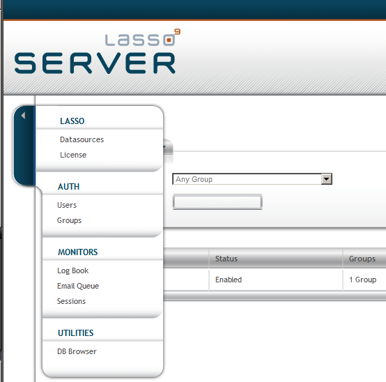

.. _instance-administration:

*******************************
Lasso 9 Instance Administration
*******************************

Lasso 9 Server provides a convenient, Web-based interface for configuring Lasso
instance settings, managing and maintaining databases, and much more. This
interface is referred to as the Lasso Server Admin.

This chapter provides an overview of Instance Administration, and is divided
into the following sections.

:ref:`Accessing Instance Administration<instance-administration-access>`
   Describes how to connect to Instance Administration.

:ref:`Exploring Instance Administration<instance-administration-overview>`
   Describes the three main sections of Instance Administration.

:ref:`Administrative Tasks<instance-administration-interface>`
   Describes the administrative tasks that can be performed in each of the main
   sections found in the Main Menu. These tasks are as follows:

   -  :ref:`Configuring Datasources<instance-administration-datasources>`
   -  :ref:`Entering Lasso 9 Server License<instance-administration-license>`
   -  :ref:`Manage Lasso Users<instance-administration-users>`
   -  :ref:`Manage Lasso Groups<instance-administration-groups>`
   -  :ref:`Monitoring & Managing Lasso Logs<instance-administration-log>`
   -  :ref:`Monitoring & Managing Lasso's Email Queue<instance-administration-email>`
   -  :ref:`Managing Lasso Sessions<instance-administration-sessions>`
   -  :ref:`Browsing Datasources<instance-administration-db-browser>`

The Lasso Server Admin is accessed via a Web browser similar to a standard HTML
page and can be accessed in any Web browser that meets the Web browser
requirements listed in the configuration sections of this guide.

.. _instance-administration-access:

Accessing Instance Administration
=================================

Lasso 9 Server can have multiple independent instances defined within
:ref:`Lasso Instance Manager<instance-manager>`. Each instance handles incoming
Web requests based on the host name used to access the admin.

A single instance will capture all incoming Web requests. If no additional
instances have been created, then Lasso Server Admin for the sole instance can
be accessed using one of the following URLs. Use localhost if accessing Lasso
Server Admin from a browser on the same machine as the Lasso Service. Otherwise,
replace www.example.com with the actual domain name or IP address::

   http://www.example.com/lasso9/admin
   http://localhost/lasso9/admin

To access the Lasso Server Admin for a particular instance, it is necessary to
construct a URL that meets the criteria for the instance.  For example, if an
instance has a criteria specifying that the host name must be secure.example.com
then the following URL would load the Lasso Server Admin for that instance::

   http://secure.example.com/lasso9/admin

The Web browser should prompt for the administrator username and password. The
Web browser will not prompt if the Lasso Server Admin has already been accessed
using the browser in the current session or if the authentication information
has been stored in a keychain, passport, or browser preferences.

If an error is displayed, make sure Lasso Service and the Web server are running
as described in the configuration sections of this guide.

   Lasso 9 Server Admin Landing Page

.. _instance-administration-overview:

Exploring Instance Administration
=================================

System Status
-------------

   Lasso 9 Server Admin System Status

The System Status tab, located in the top right portion of the page, contains
information regarding the Lasso Server process.

-  **Uptime:** Length of time current Lasso Server process has been running.
-  **CPU Time:**
-  **Threads:** Number of threads in use by current Lasso Server process.
-  **Memory:**
-  **Free:**

.. _instance-administration-quick-code:

Lasso Quick Code
----------------

Lasso Quick Code allows you to run code snippets within the Lasso Server Admin
web interface. The Lasso Quick Code console can opened by clicking the arrow tab
in the top, center of the page.

   Lasso 9 Server Admin Lasso Quick Code

The Lasso Quick Code console has two configurable options:

<?lasso
   When this option is checked, Lasso Quick Code defaults to LassoScript coding.

Auto-collect
   When this options is checked, Lasso Quick Code will automatically display the
   results of the code in the Result box. When not checked, nothing will be
   output.

Main Menu
---------

Lasso 9 Server provides a new streamlined administration interface, referred to
here as the Lasso Server Admin. The Lasso Server Admin is primarily navigated by
using the pop up menu on the upper left portion of the page.

   Lasso 9 Server Admin Main Menu

Lasso
   -  Datasources - Configure data sources.
   -  License - Enter license. (This can also be entered in Lasso Instance
      Manager.)

Auth
   -  Users - Configure Lasso users.
   -  Groups - Configure Lasso groups.

Monitors
   -  Log Book - View log messages & configure logging settings.
   -  Email Queue - View emails currently in queue.
   -  Sessions - View active sessions, delete expired sessions, and change
      session settings.

Utilities
   - DB Browser - Manage and browse databases.

.. _instance-administration-interface:

Administrative Tasks
====================

Each of the links in the Main Menu take you to different sections in Lasso
Server Admin to perform specific adminstrative tasks. These tasks are outlined
in the documentation below.

.. _instance-administration-datasources:

Configuring Datasources
-----------------------

Clicking on the "Datasources" link in the Main Menu will bring you to a web page
that lists the data sources your installation of Lasso 9 Server has access to.
Clicking on a data source will reveal a list of hosts that have already been
configured as well as an "Add host" button. Clicking on that button reveals a 
form to enter the "Host", "Port", "Username", and "Password" information for a
new host. Entering this information and clicking "Add Host" will add the new
host to the list of hosts for that data source.

Clicking on a host in the list of hosts for a data source will reveal a form
that allows you to edit the connection information for the host or to delete the
host. Below that form is a list of databases the credentials entered have access
to.

Clicking on a database reveals a form that allows the alias name for that
database to be set. The alias name is what is matched when the ``-database``
parameter is used in an ``inline`` method. Below that form is a list of tables
in the database that the entered credentials have access to.

See the :ref:`Setting Up Data Sources<datasource-setup>` chapter for detailed
information on connecting to various data sources.

.. _instance-administration-license:

Entering Lasso 9 Server License
-------------------------------

Clicking on the "License" link will take you to a web page that displays the
current license of the instance. There is also a button that will allow you to
add or change the serial number. This information can also be seen and updated
in the Instance Manager.

.. _instance-administration-users:

Manage Lasso Users
------------------

Clicking on the "Users" link in the Main Menu will take you to an interface that
allows you to add, remove, and search for Lasso users. Lasso users are stored in
the instances internal SQLite databases. Each user has a name, password, and a
status (enabled or disabled). They can optionally have a comment and belong to
Lasso groups. These users can be used with the ``auth`` methods for HTTP
authentication.

During initial installation and setup of the instance, Lasso Server Admin
creates a user in the "ADMINISTRATORS" group and uses their credentials to
authenticate anyone trying to access itself. Be sure you don't delete this user
without first creating another user in the "ADMINISTRATORS" group. In fact, you
should always have one adminstrator that can log in to Server Admin.

Search for a User
^^^^^^^^^^^^^^^^^

You have two ways to filter the list of Lasso users to find the user(s) you are
seeking. You can filter users based on their membership to a group by selecting
a group in the "Group" drop down list. Changing this selection will cause the
list of users to update itself based on the criteria you have selcted. You can
also search for a user by their name by typing part or all of the name in the
"Name" text field. As you type you will notice the list updating itself based on
the data you are entering.

Add a User
^^^^^^^^^^

To add a Lasso user, click the "Add User" button in the top right of the "Users"
interface. A dialog will appear allowing you to enter the name, password, and a
comment as well as allowing you to select which groups they should be members
of. Once all the data is correctly entered, click the "Add" button to add the
user.

Delete a User
^^^^^^^^^^^^^

To Delete a user, first find them in the listing of users. Once you have found
them, click the minus button in the column to the left of their name. You will
get a dialog box double-checking your intentions. Click the "OK" button in that
dialog box to delete the user.

.. _instance-administration-groups:

Manage Lasso Groups
-------------------

Clicking on the "Groups" link in the Main Menu will take you to an interface
that allows you to add, remove, and search for Lasso groups. Lasso groups are
stored in the instances internal SQLite databases. Each group has a name and a
status (enabled or disabled). They can optionally also have a comment. These
groups can be used with Lasso users and the ``auth`` methods for HTTP
authentication.

During initial installation and setup of the instance, Lasso Server Admin
creates a group named "ADMINISTRATORS" and any user assigned to that group can
authenticate into the Server Admin application. There is also a special group
named "Any Group" that will appear in the Users area of Server Admin and is a
way to reference every user since everyone is a member of this special group.

Search for a Group
^^^^^^^^^^^^^^^^^^

You can filter groups based on their name by typing part or all of the name in
the "Name" text field. As you type you will notice the list updating itself
based on the data you are entering.

Add a Group
^^^^^^^^^^^

To add a Lasso group, click the "Add Group" button in the top right of the
"Groups" interface. A dialog will appear allowing you to enter the name and a
comment as well as selecting the status of the group. Once all the data is
correctly entered, click the "Add" button to add the group.

Delete a Group
^^^^^^^^^^^^^^

To Delete a group, first find it in the listing of groups. Once you have found
it, click the minus button in the column to the left of its name. You will get a
dialog box double-checking your intentions. Click the "OK" button in that dialog
box to delete the group.

.. _instance-administration-log:

Monitoring & Managing Lasso Logs
--------------------------------

Clicking on the "Log Book" link in the Main Menu takes you to the Log Book web
page. The Log Book page allows you to view and delete errors, warnings, detail
messages, deprecated functionality warnings, and database action statements that
have been logged by Lasso 9 Server via the ``log`` methods. In this area you can
also set site logging options.

.. note::
   Configuring error logging in Lasso 9 Server Administration is not the same
   thing as configuring page-level error handling, such as for syntax errors and
   security errors. Page-level error handling is described in the Error
   Reporting chapter of the Lasso Language Guide.

Filter Log Messages
^^^^^^^^^^^^^^^^^^^

You can filter log entries based on their message by typing part of the message
in the "Message" text field. As you type you will notice the list updating
itself based on the data you are entering.

Delete Log Messages
^^^^^^^^^^^^^^^^^^^

There are two action buttons below the log entries table:

Delete All Messages
   This will delete all log entries stored in the SQLite database.

Delete All Found
   This will delete all log entries that have been found based on the search
   term in hte "Messages" text field above.

Log Book Settings
^^^^^^^^^^^^^^^^^

Click on the "Settings" button at the top right of the Log Book interface. A
modal window will appear with a matrix that allows you to select where each type
of log message is sent to. Make your selections and then click the "Save" button
to update Lasso 9 Server's logging settings.

.. _instance-administration-email:

Monitoring & Managing Lasso's Email Queue
-----------------------------------------

Clicking on the "Email Queue" link in the Main Menu takes you to a web page that
displays Lasso 9 Server's email queue. The email queue logs all email messages
that are sent from Lasso Server. Messages remain in the queue while they are
being sent to the SMTP mail server looked up by Lasso or specified in the
[Email_Send] method by the developer. For more information, see the Email
chapter in the Lasso Language Guide.

Filtering Email Messages
^^^^^^^^^^^^^^^^^^^^^^^^

You can filter the email messages in the queue being displayed by their status:
"Any", "Queued", "Sending", "Error". Simply choose one of those statuses from
the "Queue Status" drop-down menu and the queue entries will automatically
update to reflect your selection.

Deleting Email Messages
^^^^^^^^^^^^^^^^^^^^^^^

To remove an email message from the queue, first find it in the listing of
entries. Once you have found it, click the minus button in the column to the
left of its ID. You will get a dialog box double-checking your intentions. Click
the "OK" button in that dialog box to remove the message from the queue.

.. _instance-administration-sessions:

Managing Lasso Sessions
-----------------------

Clicking on the "Sessions" link in the Main Menu takes you to to an interface
that allows you to browse and manage sessions in real time as well as configure
the location for storing sessions.

Viewing Sessions
^^^^^^^^^^^^^^^^

Sessions can be stored in any of the available datasources for your installation
of Lasso 9 as well as in memory. The default is to use an SQLite database and
table to store session information. You can view the session information you
have stored in any of the data sources by selecting the data source from the
"Driver" drop-down menu and then selecting the appropriate values in the
"Database" and "Sessions Table" drop-down menus if appropriate. (These last two
menues will be disabled for the "SQLite" and "In memory" drivers. Otherwise they
will show the databases / tables you have access to for the selected driver's
data source.)

Deleting Expired Sessions
^^^^^^^^^^^^^^^^^^^^^^^^^

Clicking the "Delete Expired Sessions" button underneath the "Driver" drop-down
menu will remove all expired session entries from the currently selected session
data source / table. By default, Lasso 9 Server periodically clears out expired
sessions, so it is not usually necessary to manually run it yourself.

Configuring Session Storage Location
^^^^^^^^^^^^^^^^^^^^^^^^^^^^^^^^^^^^

Out of the box, Lasso 9 Server is configured to keep session information using
the "SQLite" session driver. You can change this by taking the following steps:

#. Selecting the driver you wish to use from the "Driver" drop-down menu.
#. If the driver is not "SQLite" or "In memory", then you will need to select a
   value from the "Database" drop-down menu and the "Sessions Table" drop-down
   menu. (You can click the "Create Sessions Table" button below the "Sessions
   Table" menu to have Lasso 9 create a table in the selected database with the
   correct schema for storing sessions. If you click this button, you will be
   given the chance to name the table whatever you desire, and then that new
   table will be selected in the "Sessions Table" drop-down menu.)
#. Click the "Select As Default Driver" button to have the ``session_start``
   method use your selection for storing session information.

.. _instance-administration-db-browser:

Browsing Datasources
--------------------

Clicking on the "DB Browser" link in the Main Menu takes you to the DB Browser
section of Lasso Server Admin. The DB Browser provides a Web-based interface
that allows you to issue SQL queries to Lasso-accessible SQL databases. This
includes any SQLite, MySQL, or SQL-compliant ODBC database that has been set up
in the Datasource area of Lasso Sever Admin.

Browsing data is as easy selecting the appropriate values in the "Datasource",
"Host", "Database", and "Table" drop-down menus. The Server Admin will
automatically issue a "SELECT \*" on the chosen table and display the results in
the table below.

You can run your own SQL statements on the chosen host/database/table by
entering them in the provided "Statement" textarea and clicking the "Issue
Statement" button below the textarea. The results will be shown in the table
below. If there are any errors in your SQL statement, an alert message will
inform you of the error and no results will be displayed.