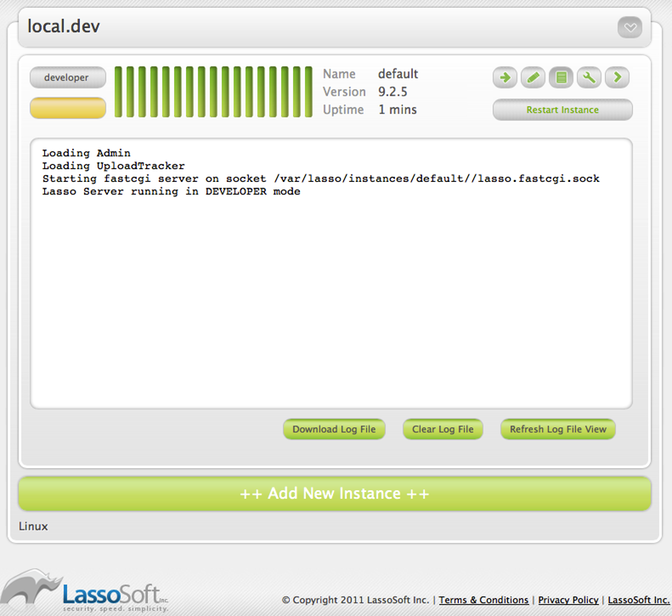

.. _instance-manager:

****************
Instance Manager
****************

Lasso Instance Manager is a companion tool wrapped into Lasso 9 Server which
permits the management of one or more Lasso 9 instances. This tool can install &
uninstall new Lasso 9 instances and allows those instances to be configured in
one convenient location.

Lasso Instance Manager stands as an intermediary for the individual Lasso 9
instances. Each Lasso 9 instance is configured with a host name pattern. Lasso
Instance Manager catches all requests with the file extension .lasso and all
requests where the URI begins with /lasso9/. It uses the instance host name
patterns to determine which running Lasso 9 instance should serve each request.

Initialization
==============

After the first installation, you will be presented with simple install
acknowledgment and a process to initialize and create the first new instance.
Under OS X this will be a web page; under Linux you will see an output in the
terminal that gives the URL of http://<IP address>/lasso9/instancemanager.

When Lasso Instance Manager is run for the first time it will look for an
existing Lasso 9.0 installation that was installed through the Lasso 9.0
installer package and will import that instance. No files will be removed.  The
Admin LassoApp will be updated and any existing Lasso 9.0 Apache 2 configuration
file will be disabled.

If no existing Lasso 9.0 instance is located, a new Lasso 9 instance will be
created as a default. This default instance will be configured with the same
administrative username and password that was selected when first initializing
Lasso Instance Manager.

Main UI
=======

The main interface for Lasso Instance Manager consists of a list of all known
Lasso 9 instances on that machine. Below this list is a button allowing a new
instance to be created.

Each instance in the list shows:

-  Current licensing mode, based on the instance serial number, if any.
-  Current run status: red is not running, yellow is running but with a
   provisional license, green is running and fully licensed.
-  Instance name
-  Instance version
-  Instance uptime

   Instance Manager Main Screen

In addition, a row of buttons permit access to the following:

-  Instance configuration: instance name, description, url, home path, OS user, host
   pattern, disable instance, delete instance
-  Instance notes
-  Instance output log
-  Instance environment variables
-  Instance URL link

Finally, a "Restart Instance" button makes restarting an instance two clicks
away.

Note that Lasso Instance Manager automatically periodically updates the
interface to show each instance's status.

Add a New Instance
==================

Click the "++ Add New Instance ++" button at the bottom of the interface. This
will present a form allowing you to customize the Lasso instance to be created.
When done, click the "+ Add" button at the bottom to create your new instance.

   Adding a Lasso 9 instance

Fields
------

Instance Name
   This is the name of the new instance. It serves to uniquely identify the
   instance amongst the others.

Host Patterns
   An host pattern is a string pattern of characters that are matched against
   the incoming HOST field of the HTTP request. An instance may have several of
   these patterns. These patterns serve to direct individual requests to
   specific Lasso instances. A host pattern resembles a domain name but can
   contain the wildcard character "%". The pattern "%foo.com" would match
   "www.foo.com" and "foo.com". The pattern "localhost" would match only
   "localhost". If no instance is configured to respond to a given host, an
   error will be returned to the client.

Instance URL
   This URL is used only within the Instance Manager. This URL provides a
   convenient link from the Instance Manager to a page served by that Lasso
   instance. By default, this link will point to the Lasso 9 Admin App for that
   instance.

Description
   A convenient, optional description of this Lasso instance.

Serial Number
   If you already have a serial number for the new instance, enter it here.

OS User
   The new instance will consist of a process that runs as this specific
   operating system user. Additionally, the Lasso home directory will have its
   permissions adjusted to restrict access to other users besides this one. The
   default user name is \_lasso.

OS Group
   This group name will be used for adjusting the Lasso home directory
   permissions. If left blank, the OS User's default group will be used. The
   default group is \_lasso, which is used with the OS User name of \_lasso.

Home Parent Directory
   Every Lasso Instance has a home directory. This directory is automatically
   created *inside of the path indicated by this form field* when the instance
   is created. This field **only** indicates the path up to the directory **in
   which** the new instance's home directory will be created. The name of the
   new instance's home directory will be the name of the instance (specified in
   the first form field). Note that illegal characters and spaces will be
   stripped from the new directory name.

   -  Unless manually edited, new instance home directories are created in a
      specific location within the directory housing the Lasso Instance Manager.
      This location will differ based on the platform Lasso Instance Manager is
      running on. This location is shown at the time a new instance is being
      created. If this path is edited, the new value will become the default for
      subsequently created instances (where the path can be further edited).

   -  By default, permissions on the new instance's home directory will be set
      to that as specified in the OS User and OS Group fields.

The most important bits of information to fill in are the instance name and the
host pattern. The rest can be left as-is unless you hav a specific need to
tailor this instance.

By default, all new instances run as the \_lasso operating system user. For best
security between different Lasso instances, use a different OS user name for
each. As an OS user is permitted to read files owned by that user, Lasso
instances with the same OS user are able to share files amongst themselves. In
many cases this is not a problem, or is even desired, but if a single computer
is hosting many instances for many different users, differing usernames may be
required.

Delete an Instance
==================

When an instance is no longer required, it can be removed. First click the
"Instance Details" button to expose the details for the instance. This view
contains a "Delete Instance" button and a checkbox for indicating that the
instance's home directory should be deleted as well. If this checkbox is not
checked when the "Delete Instance" button is clicked, the instance's home
directory will be left in place. Deleting an instance will terminate that
instance's process, remove the instance from the list and optionally delete the
instance's home director.

Disable Instance
================

If an instance needs to be temporarily disabled, first click the "Instance
Details" button to expose the details for the instance. Then, click the "Disable
Instance" button. This will terminate the instance's process. The instance will
no longer be automatically started and can no longer serve requests. To re-
enable the instance, click the "Start Instance" button near the top of the
instance view.

Change an Instance's Configuration
==================================

After an instance has been created, the instance's host patterns and URL can
still be modified. Click the "Instance Details" button to expose the details for
the instance. A button is shown next to the editable items. Click the button and
follow the directions to edit these items.

An existing instance's serial number can also be updated. Click the button in
the instance view which shows the instances licensing status (upper left corner
button). A dialog will appear permitting a new serial number to be entered.
Setting an instance's serial number will restart that instance.

Restart an Instance
===================

Clicking the "Restart Instance" button will cause an alert asking whether or not
you really want to restart the instance. Pressing "Cancel" will clear the alert
window and nothing further will happen. Pressing "OK" will terminate the instance's process
and then restart that process. The instance's running light will switch
to green or yellow once the instance is fully running again.

If the instance isn't currently running, the button will say "Start Instance",
and pressing that button will not result in a prompt, but will promptly start
the instance.

Add Instance Notes
==================

Instance notes are for personal usage. They permit reminders or important
details to be associated with an instance. To add an instance note, click the
"Notes" button to reveal the instance notes view. Type your note in the provided
textarea and then click the "+ Add Note" button.

View Instance Logs
==================

   Viewing Lasso 9 Instance Logs

Lasso Instance Manager captures the last number of lines of  console output
generated by a Lasso instance. Click the "Logs" button to show the log for an
instance. While the view is shown, the log data will automatically refresh. The
data can be manually refreshed by clicking the "Refresh Log File View" button.
Each log can be cleared or downloaded by clicking the appropriate button in this
view.

Modify Instance Environment Variables
=====================================

   Adding Lasso 9 Instance specific variables

Environment variables control how an instance runs or how the software an
instance is utilizing (e.g. ImageMagick or Java) operates. Click the "Variables"
button to expose the environment variables view. All current variables are shown
in this view. Existing variables can be removed and new variables can be added.
Any variable modifications will not take affect until the instance is restarted.

New instances are automatically configured with the LASSO9\_HOME and
LASSO9\_MASTER\_HOME variables. It is recommended that these not be modified or
removed unless a highly customized instance is required.

.. _instance-manager-home-directory:

Instance Home Directory Contents
================================

A Lasso instance's home directory can contain several folders & files which can
be used to tailor the instance. Specifically, these are the "LassoModules",
"LassoLibraries", and "LassoApps" directories. However, by default, an instance
will also look to these directories in the Instance Manager's home directory.
Files can be placed in the proper location inside of the instance's home
directory in order to override the files provided by the Instance Manager.

LassoModules
------------

The "LassoModules" directory contains all Lasso C-API (LCAPI) modules, These are
all loaded when an instance is first started. The instance will first load all
modules located in the Instance Manager's home, and then all modules located in
the instance's home. This permits an instance to replace an LCAPI module with
its own version, if required, or to have an instance-specific LCAPI module.

LassoLibraries
--------------

The "LassoLibraries" directory contains all available on-demand libraries. These
libraries are loaded as required as the instance runs. Whenever an attempt is
made to utilize a non-existant method or type, the "LassoLibraries" directory is
searched for a suitable implementation. An instance will first look in it's own
home directory for such a library. If not found, the Instance Manager's home
directory is searched. This permits an instance to override a library which
would have been loaded from the Instance Manager home directory with it's own
version, or to have an instance-specific library.

LassoApps
---------

The "LassoApps" directory contains applications that are loaded when an instance
starts up. At startup, the instance gets all the applications in the Instance
Manager's "LassoApps" directory and compares it with the applications in its own
"LassoApps" directory. Those applications in the Instance Manger's "LassoApps"
directory with the same name as  those in the instance's home directory do not
get loaded while the others are. This allows an instance to install its own
version of a Lasso application with the same name without ever loading the
Instance Manager's version.

Starting & Stopping Lasso Instance Manager
==========================================

Stopping the Lasso Instance Manager process differs on each platform.

Mac OS X
   Execute the following command from the terminal::

      sudo launchctl unload
      /Library/LaunchDaemons/com.lassosoft.lassoinstancemanager.plist

Linux
   The CentOS 5 installer creates a service "lassoimd" for the Instance Manager
   executable, which loads at startup. To stop execute the following command
   from the terminal::

      sudo service lassoimd stop

Stopping the Instance Manager will also stop all Lasso instances. No Lasso
instance will be able to serve any requests while the Instance Manager is not
running.

When installed, Lasso Instance Manager is configured to automatically
start when the computer boots up. If the Instance Manager has been
manually stopped it can be manually started again.

Mac OS X
   Execute the following command from the terminal::

      sudo launchctl load
      /Library/LaunchDaemons/com.lassosoft.lassoinstancemanager.plist

Linux
   The CentOS 5 installer creates a service "lassoimd" for the Instance Manager
   executable, which loads at startup. To start this service, execute the
   following command from the terminal::

      sudo service lassoimd start

Uninstalling Lasso Instance Manager
===================================

On Mac OS X, an uninstaller is provided in the same package as the original
installer. Run this to uninstall Lasso Instance Manager. This action will remove
any Lasso instance home directories which have been created in the default
location. This will not remove any home directories which were created in
alternate custom locations. On Linux, use the standard package manager (yum or
apt) to uninstall Lasso Instance Manager.